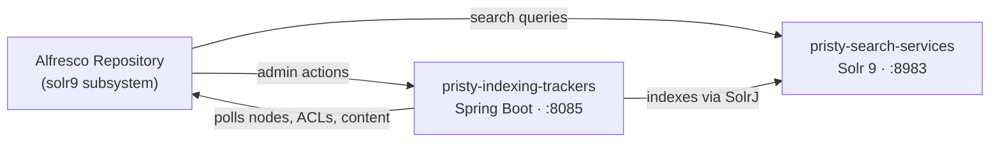

# Pristy Search Services

**Alfresco search, rebuilt on vanilla Apache Solr 9.**

[](LICENSE)
[](https://solr.apache.org/)
[](https://adoptium.net/)
[](https://hub.docker.com/r/jeci/pristy-search-services)
[](https://hub.docker.com/r/jeci/pristy-indexing-trackers)

A community fork of Alfresco Search Services for **Alfresco Community Edition**:
same AFTS and CMIS queries, same permission filtering, same repository API —
on a current, unpatched Solr and Lucene, with indexing split out into its own service.

It is the search tier of [Pristy ECM](https://pristy.fr) and runs just as well
behind a stock Alfresco Community repository.

## Highlights

- **Vanilla Solr 9.10.1 / Lucene 9.12.3 on Java 17.** No Alfresco-patched Solr build:
  upgrading Solr becomes a version bump, not a port.
- **Indexing as a separate service.** The trackers run in `pristy-indexing-trackers`,
  a Spring Boot application. Restart, scale and tune indexing without touching query serving.
- **Drop-in for your queries.** AFTS, CMIS, ACL filtering, highlighting, facets and
  APATH drill-down behave as before.
- **Operable.** Admin actions (`SUMMARY`, `REPORT`, `REINDEX`, `PURGE`, `BACKUP`,
  `RESTORE`…) over REST and in the classic Solr admin format, a per-node indexing
  verdict (`/api/v1/index/node`), live progress over Server-Sent Events, and a repair
  tracker that retries failed nodes.
- **Tunable per core.** Crons, batch sizes and parallelism have a global default and a
  per-core override, all settable through environment variables.
- **Recency-aware ranking.** The `rerankRecent` core template lets fresher documents
  outrank older ones of equal relevance.
- **Secure by configuration.** `none`, shared `secret` or mutual TLS, set independently
  on each channel.
- **Lean.** Insight Engine, Zeppelin and the governance services are gone.

## Architecture



| Service | Image | Role |
|---------|-------|------|
| Solr | [`jeci/pristy-search-services`](https://hub.docker.com/r/jeci/pristy-search-services) | Serves queries and stores the index. |
| Trackers | [`jeci/pristy-indexing-trackers`](https://hub.docker.com/r/jeci/pristy-indexing-trackers) | Reads the repository, feeds Solr, serves the admin API. |

Both are required and are released together: keep them on the same tag.

## Quick start

With an Alfresco Community repository reachable at `http://alfresco:8080/alfresco`:

```yaml
services:
  solr:
    image: jeci/pristy-search-services:1.1.0
    entrypoint: ["/opt/pristy-search-services/solr-init-core.sh"]
    environment:
      SOLR_ALFRESCO_HOST: alfresco
      SOLR_ALFRESCO_PORT: "8080"
      SOLR_SOLR_HOST: solr
      SOLR_SOLR_PORT: "8983"
      SOLR_CREATE_ALFRESCO_DEFAULTS: alfresco,archive
      ALFRESCO_SECURE_COMMS: secret
      JAVA_TOOL_OPTIONS: "-Dalfresco.secureComms.secret=please-change-me"
    volumes:
      - solr-data:/opt/pristy-search-services/data
      - solr-home:/opt/pristy-search-services/solrhome

  trackers:
    image: jeci/pristy-indexing-trackers:1.1.0
    environment:
      ALFRESCO_TRACKER_SOLR_URL: http://solr:8983/solr
      ALFRESCO_TRACKER_SOLR_SECURECOMMS: secret
      ALFRESCO_TRACKER_SOLR_SHAREDSECRET: please-change-me
      ALFRESCO_TRACKER_REPOSITORY_URL: http://alfresco:8080/alfresco
      ALFRESCO_TRACKER_REPOSITORY_SECURECOMMS: secret
      ALFRESCO_TRACKER_REPOSITORY_SHAREDSECRET: please-change-me

volumes:
  solr-data:
  solr-home:
```

On the repository, install `fr.pristy:pristy-search-subsystem-solr9` in `WEB-INF/lib`
and start it with:

```
-Dindex.subsystem.name=solr9
-Dsolr.host=solr -Dsolr.port=8983
-Dsolr.tracker.host=trackers -Dsolr.tracker.port=8085
```

Coming from Alfresco Search Services 2.x (Solr 6)? A **full re-index** is required —
see the [administrator guide](docs/solr9-admin-guide.md).

## Documentation

| Guide | For |
|-------|-----|
| [Administrator guide](docs/solr9-admin-guide.md) | Upgrading, configuration, backup, re-indexing |
| [Tracker configuration](docs/tracker-configuration.md) | Every tracker setting, global and per core |
| [Tracker admin endpoints](docs/tracker-admin-endpoints.md) | Reports, reindex, purge, backup — with `curl` examples |
| [Indexing progress](docs/indexing-progress.md) | The live progress stream and its demo page |
| [Secure communications](docs/secure-comms-https.md) | `none`, `secret` and mutual TLS |
| [Debugging](docs/debugging.md) | Diagnosing missing or unexpected results |
| [Solr 6 → 9 migration record](docs/solr6-to-solr9-migration.md) | What changed under the hood |
| [Release process](docs/release.md) | Branches, versioning, what a tag publishes |

Full index: [docs/README.md](docs/README.md) — history: [CHANGELOG.md](CHANGELOG.md).

## Development

Requires Java 17, Maven 3.9+ and, recommended, [mise](https://mise.jdx.dev/), which
installs both and provides the tasks below.

```bash
mise install
mise run build          # build without tests
mise run test           # unit tests
mise run dev:up         # local stack: Alfresco + Solr + trackers
mise run dev:logs
mise run dev:down
```

End-to-end tests run against a full Docker Compose stack:

```bash
mise run install
mise run e2e:build-image
mise run e2e:generate
mise run e2e:up
mise run e2e:test
mise run e2e:down
```

`mise tasks` lists everything else (trackers, audit, SBOM, changelog).

```
search-services/
├── pristy-search/                  # Solr plugins and query parsers (AFTS, CMIS)
├── pristy-indexing-trackers/       # Standalone indexing service (Spring Boot)
├── pristy-solrclient-lib/          # Client for the Alfresco Repository API
├── pristy-search-subsystem-solr9/  # "solr9" Search subsystem for the repository
└── packaging/                      # Distribution ZIP and Docker images
e2e-test/                           # End-to-end tests
```

## Support

Built and maintained by [Jeci](https://jeci.fr), the company behind
[Pristy](https://pristy.fr). Jeci offers commercial support on Alfresco Community
Edition, and on this search module in particular.

This is an independent community fork, **not affiliated with Hyland / Alfresco** and
not supported on Alfresco Enterprise.

## Contributing

Issues and merge requests are welcome on
[GitLab](https://gitlab.com/pristy-oss/pristy-search-services) — see
[CONTRIBUTING.md](CONTRIBUTING.md).

## License

[LGPL v3](LICENSE). Alfresco-derived sources keep their original copyright headers;
Solr-derived sources keep the Apache License 2.0.
